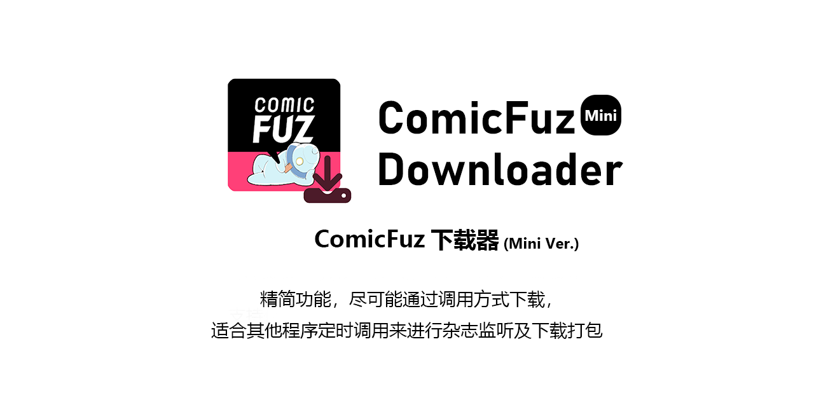

## 简介

[ComicFuz-Downloader](https://github.com/misaka10843/ComicFuz-Downloader)的Mini Ver，致力于能够第一时间获取杂志信息并且自动下载

## 支持功能

删除线部分均为[Full Ver](https://github.com/misaka10843/ComicFuz-Downloader)所支持的

* ~~漫画/单行本/~~ 杂志多线程下载
* 使用代理
* 自定义线程数量
* 自定义下载文件夹
* 支持登录
* ~~支持自动压缩图片(可自定义压缩率)/~~ 生成压缩包
* 下载出错时等待5s后自动重试
* ~~**批量下载(详细请见命令示例)**~~

## Mini Ver与Full Ver的区别

Mini Ver尽可能精简功能，并且仅支持调用

理论上Mini Ver只支持在登录状态下下载杂志，并且自动进行压缩

尽可能支持NoneBot的调用（没错，Mini Ver是NoneBot插件中的插件x）